# Blenderでエクスポートしたメッシュをmixamoでアニメ付けする
キャラクターのサイズや体形がBaseArmatureと異なる場合などは、Adobe社が提供しているWebサービル[mixamo(ミクサモ)](https://www.mixamo.com/)を利用して、自動ウェイト設定をするのがオススメです。mixamoでアニメーションを設定して、Unityで動作確認をする手順です。

mixamoを利用するには、無料の会員登録(Sign up)が必要です。事前に登録してログインしておいてください。

## MagicaVoxelでキャラクターを作成する
この方法の場合は、`base.vox`から作業を開始する必要はありません。いわゆる[Tポーズ](https://www.google.co.jp/search?q=T%E3%83%9D%E3%83%BC%E3%82%BA&tbm=isch)になっていればOKです。

- キャラクターが完成したら、*Export* -> *ply*をクリックします

- 分かりやすい場所に任意のファイル名で保存します。ファイル名は半角英数のみ推奨(日本語や全角が混じったファイル名だとUnityで不具合が起きる可能性があります)

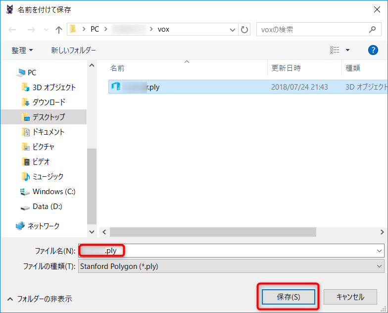

## BlenderにPLYをインポート
ここからはBlenderでの作業です。必要なファイルを読み込みます。

- Blenderが起動していなければ起動します。あるいは、*File*メニューから*New*を選択して、初期状態にします
- 既存の*Camera*, *Cube*, *Lamp*全て不要なので、[Shift]キーを押しながらクリックして3つとも選択します

- エディター上にマウスカーソルを移動させて、[Delete]キーを押して表示されるポップアップの*Delete*をクリックして、選択していたものを削除します

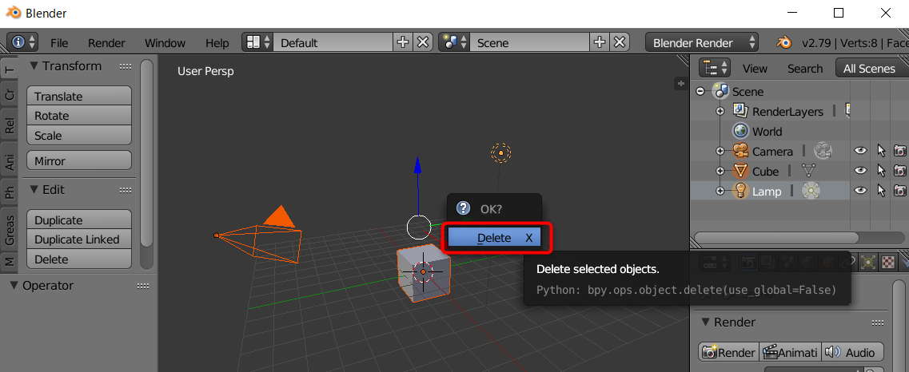

*Outliner*から選択したオブジェクトが消えていればOKです。

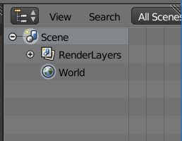

- 3D Viewの左のメニューで*Misc*タブをクリックして選択して、*Import PLY*ボタンをクリックします

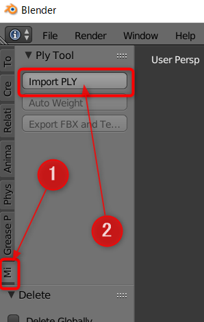

- PLYファイルを保存したフォルダーを設定して、読み込むファイルを選択して、*Import PLY*ボタンをクリックします

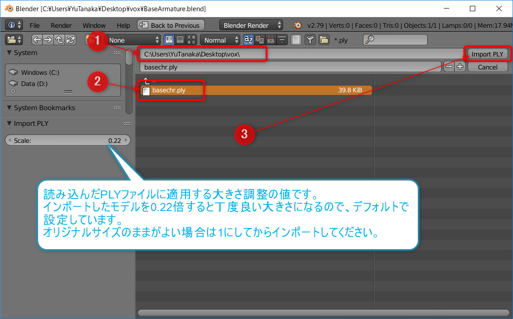

> デフォルトのPLYのサイズだとUnityでは大きくなりすぎるので、0.22倍するようにしています。倍率は左下の*Scale*欄で設定できるので、読み込みと同時にサイズを調整したい場合は、値を変更してから*Import PLY*をクリックしてください。

PLYファイルのインポートが完了しました。

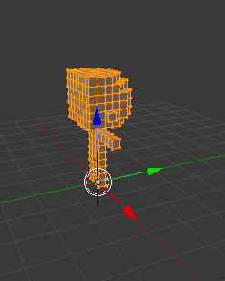

## FBXとPNGをエクスポート
mixamoを利用するならBlenderでウェイトを設定する必要はないので、このままFBXにエクスポートします。

- *Export FBX and Texture*ボタンをクリックします

- エクスポート先とファイル名を設定したら*Export FBX and Texture*ボタンをクリックすれば完了です

> デフォルトで生成されるテクスチャーのサイズは512x512ピクセルです。ボクセル数が多いと足りないかも知れないので、Unityで見た時に色がずれているような場合は、*Texture Width*と*Texture Height*を`1024`や`2048`に変更してみてください。

> ボクセル数が少なくて、もっと小さいテクスチャーで構わない場合は`128`や`256`にしてみてください。テクスチャーのサイズは2のテクスチャーのサイズは2の累乗である必要があります(よく分からない場合は、この設定はいじらないでください)。

以上で完了です。出力先のフォルダーに、以下のように`fbx`と`png`の2つのファイルが出力されていれば成功です。

## mixamoにモデルを読み込む
生成したFBXとPNGをmixamoにアップロードするには、ZIP圧縮しておく必要があります。

- `FBX`ファイルと`PNG`ファイルを選択して、右クリック -> *送る* -> *圧縮(zip形式)フォルダー*を選択します

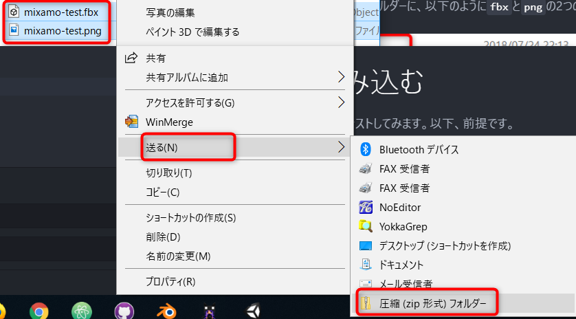

FBXやPNGのあったフォルダーにZIPファイルが出来上がります。

- [mixamo](https://www.mixamo.com/)のページを開いて、ログインします
- *UPLOAD CHARACTER*ボタンをクリックします

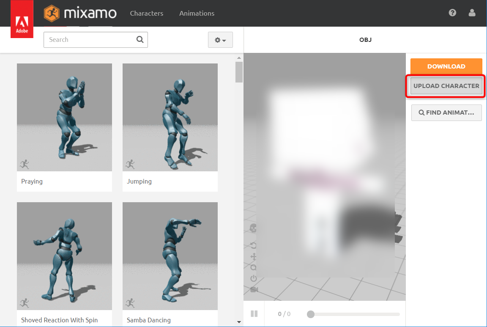

- 先ほど作成した*ZIP*ファイルをドラッグして、mixamoの点線の枠内にドロップします

- モデルが表示されます。こちらを向いて立っているのが確認できたら*NEXT*をクリックします
  - 変な方向を向いていたら、左下の矢印をクリックして、以下の画像のように調整してから*NEXT*をクリックしてください

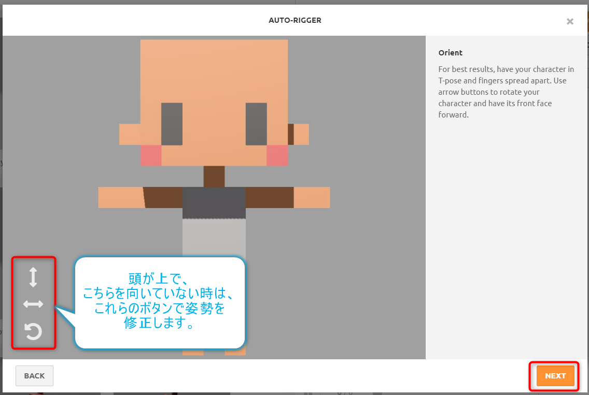

- 左下に並んでいる丸をドラッグして、キャラクターの該当する場所に設定します
  - 左右が分かりづらいので、以下を参考にしてみてください
  - 左に並んでいる丸は、左半身用なので、向かって右側の関節に設定します

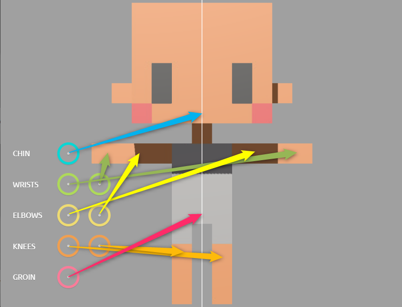

以下、設定例です。

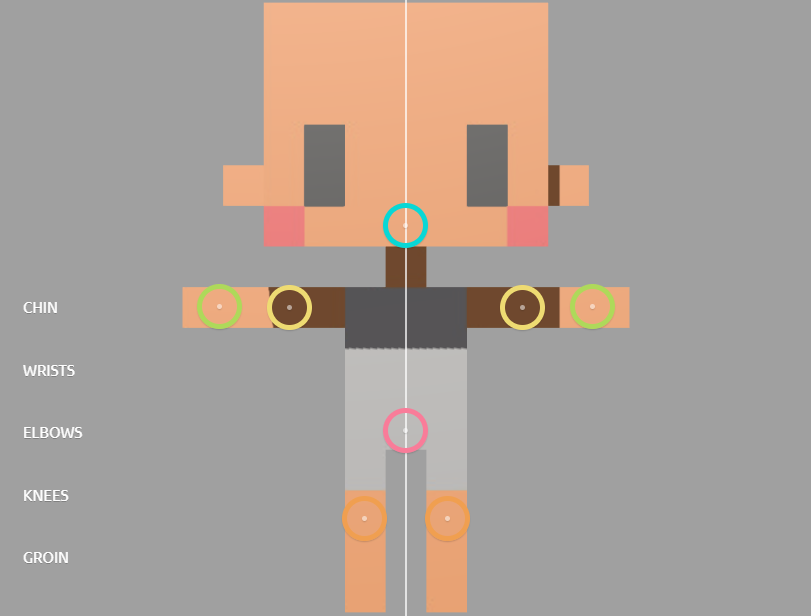

- 指がないボクセルモデルの場合は、下で指の設定を`No Fingers`にします

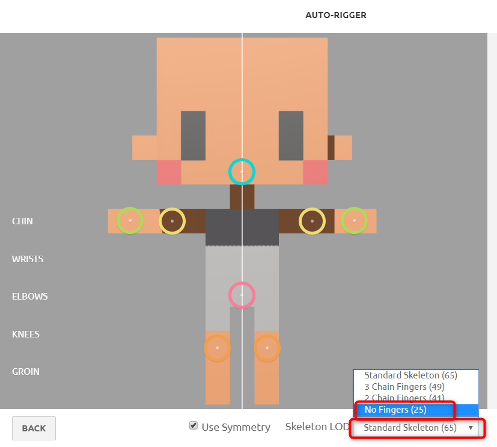

- 設定が完了したら*NEXT*をクリックします

キャラクターがくるくる回って、自動的にウェイトを設定する処理が行われます。完了を待ってください。

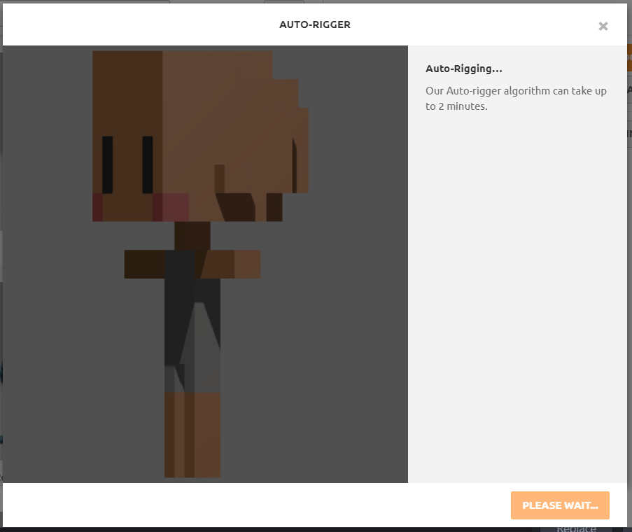

ウェイト設定が成功すると、アニメーションのデモが動きます。うまく動いていたら、*NEXT*ボタンをクリックします。

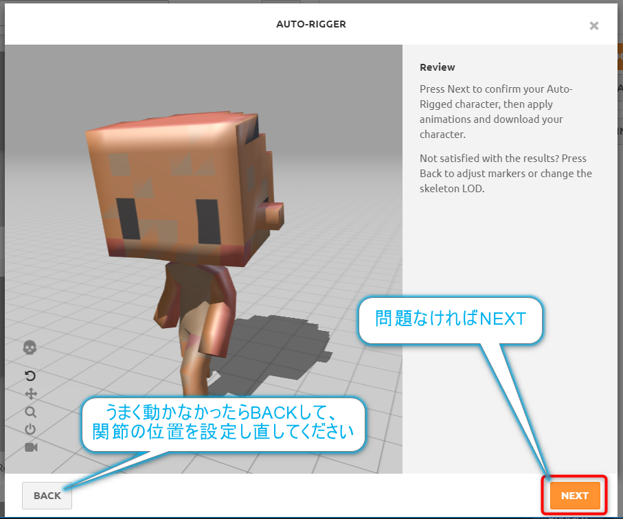

失敗していたら、*BACK*ボタンで戻って、間接の設定をし直してください。

色がおかしいのはUnityに持っていけば治るので放っておいて構いません。

以下の画面で*NEXT*をクリックしたら読み込み完了です。

## アニメの作成とエクスポート
アップロードとウェイト設定が完了したら、以下の画面に切り替わります。

左でモーションの選択、右のパラメーターで腕の広げ方や速度などのアニメーションの微調整ができます。使い方は他の記事を検索してください。ここではそのままデータをダウンロードします。

- 右上の*DOWNLOAD*ボタンをクリックします
- 以下の設定をして、*DOWNLOAD*します
  - *Format*は、*FBX for Unity(.fbx)*
  - *Pose*は、*T-pose*のままで大丈夫です
  - 設定したら、*DOWNLOAD*ボタンをクリックします

以上で、メッシュ、アニメーション、マテリアル、テクスチャーを埋め込んだFBXファイルをダウンロードできます。

できあがったキャラクターをUnityで動かしてみましょう。

### アニメを仕込んだ場合
mixamoでアニメーションを付けた場合は、エクスポートの設定項目が増えます。以下のようなダイアログだった場合の設定です。

- *Format*は、*FBX for Unity(.fbx)*
- *Frames per Second*は、*60*が使いやすいと思います
- その他はそのままで*DOWNLOAD*します

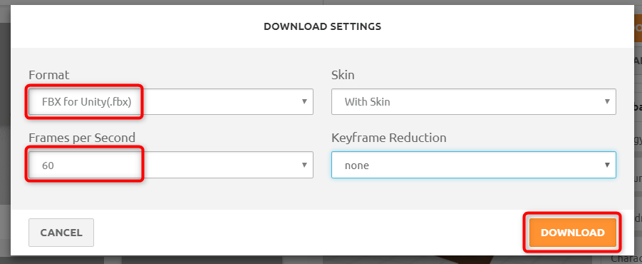

# Unityで動作確認する
作成したモデルをUnityに読み込んで動かしてみましょう。以下、前提です。

- Unity2018.1.3で確認(2017以降なら似たような操作でいけると思います)
- Standard Assetsインストール済み

## テスト用シーンを作成する
Unityを起動して、確認用のプロジェクト(空のプロジェクトでよいです)を開きます。

- *Assets*メニューから*Import Package* -> *Characters*を選択して、*Import*します

- 地面用のPlaneを作成します。*Hierarchy*ビューの*Create*をクリックして、*3D Object* -> *Plane*を選択します

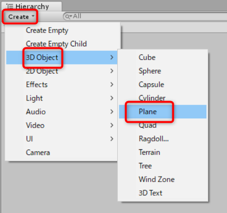

- *Hierarchy*ビューで作成した*Plane*をクリックして選択します
- *Inspector*ビューで、*Transform*の右の歯車アイコンをクイックして、*Reset*を選択して、場所を原点にしておきます

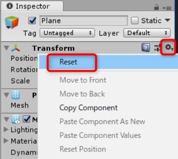

- *Plane*にマテリアルを設定して色を着けたり、*Main Camera*の位置を調整して、*Game*ビューでそれっぽく見えるようにします

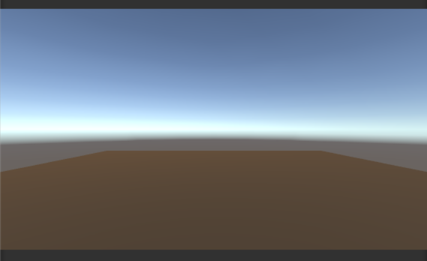

- *Project*ビューで、*Standard Assets* -> *Characters* -> *ThirdPersonCharacter* -> *Prefabs*の左の三角アイコンをクリックして開きます

- *ThirdPersonController*プレハブをドラッグして、*Scene*ビューで良さそうな場所に配置します

テスト用のシーンができました。*Play*して、矢印キーや[A][S][D][W]キーでキャラクターを操作できます。

## 作成したキャラクターを設定
エクスポートしたキャラクターを読み込み、設定します。

- mixamoからダウンロードした`FBX`ファイルをドラッグして、Unityの*Project*ビューの読み込みたい場所にドロップします

- *Project*ビューで読み込んだモデルをクリックして選択します
- *Inspector*ビューで、Materialsタブを選択して、*Extract Textures...*をクリックして、適当なフォルダー(*Textures*フォルダーなど)を選択します

- 同様に、*Extract Materials...*をクリックして、適当なフォルダー(*Materials*フォルダーなど)を選択します
- *Project*ビューで、展開したテクスチャーを選択します

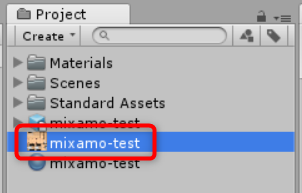

- *Inspector*ビューで以下を設定します
  - *Generate Mip Map*のチェックを外す
    - 小さくした時に変な線が出ることがあるので
  - *Wrap Mode*を*Clamp*に設定
    - 画像端のにじみ防止
  - *Filter Mode*を*Point(no filter)に設定
    - にじみ防止
  - 以上できたら、*Apply*ボタンをクリック

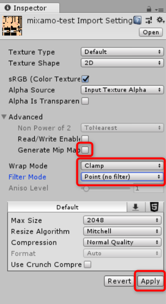

- *Project*ビューで、読み込んだモデルをクリックして選択します(名前は実際に読み込んだものに読み替えてください)

- *Model*について、以下を設定します
  - *Import Visibility*, *Import Cameras*, *Import Lights*のチェックを外す
    - くっついてませんが念のため
  - 設定したら*Apply*ボタンをクリック

- *Rig*について、以下を設定します
  - *Animation Type*を*Humanoid*に変更します
  - *Apply*ボタンをクリックします

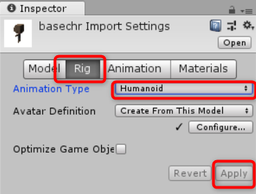

これで、*Configure...*の左にチェックが表示されれば成功です。これをやらないと、設定したアーマチュアなどの設定が反映されないので重要な設定です。

以上でキャラクターの読み込みと設定完了です。

## プレイヤーに適用して動かす
読み込んだモデルをテスト用のキャラクターに差し替えて動かして見ましょう。

- *Hierarchy*ビューで、*ThirdPersonController*の左側の三角をクリックして開きます

- *Hierarchy*ビューで、[Shift]キーを押しながら、*EthanBody*, *EthanGlasses*, *EthanSkeleton*の3つを選択します

- *Inspector*ビューの左上のチェックを外して、選択したオブジェクトを無効にします

- *Project*ビューから読み込んだモデルをドラッグして、*Hierarchy*ビューの*ThirdPersonController*にドロップします(名前は実際に読み込んだものに読み替えてください)

- *Hierarchy*ビューで、ドロップしたモデルをクリックして選択します

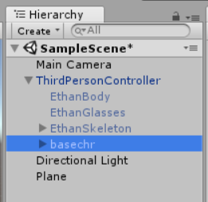

- *Inspector*ビューで、*Animator*の左のチェックを外して、モデルにくっついているアニメーターを無効にします

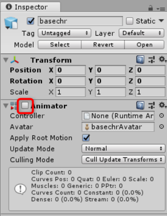

ThirdPersonControllerのアニメーターを作成したモデルで再生するようにします。

- *Project*ビューで、読み込んだモデルの左の三角をクリックして開いておきます

- *Hierarchy*ビューで、*ThirdPersonController*をクリックして選択します

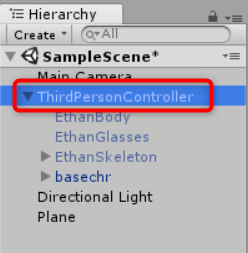

- *Project*ビューからモデルの子供にある*Avatar*をドラッグして、*Inspector*ビューの*Avatar*欄にドロップします

これで、*ThirdPersonController*のアニメーターが、オリジナルキャラクターのアバターを制御するようになります。

*Play*して、矢印キーなどで操作してみてください。エクスポートに成功していたらアニメーションを確認できます。

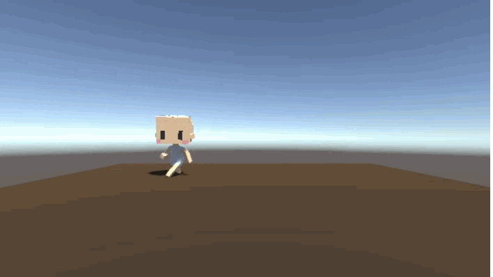

## キャラクターの大きさを調整したい場合の注意点
動かして見るとちょっとキャラクターが大きすぎるようです。半分の大きさにしてみます。

重要なのは、**親のゲームオブジェクトのScaleを変更しないこと**です。変更するのは、子供にしたモデルのオブジェクトのScaleにしてください。以下の通りです。

RigidbodyをアタッチしているゲームオブジェクトのScaleは、必ず`1`にしておきます。これを守らないと当たり判定や動作で予想外の不具合を引き起こします。必ず守りましょう！

# まとめ
以上で、MagicaVoxelで作成したPLY形式のキャラクターに、maximoでウェイト設定をして、Unityに読み込んで、テスト動作させることができました。

mixamoを利用することで、モデルの体形の自由度があがり、モーションもmixamoで生成することができるようになります。

ご活用いただければ幸いです。

# 参考・関連URL
- [Blender](https://www.blender.org/)
- [MagicaVoxel](https://ephtracy.github.io/)
- [Blender 2.79.0 855d2955c49 - API documentation](https://docs.blender.org/api/2.79/)
- [mixamo](https://www.mixamo.com/)
- [だいし. MagicaVoxelで作ったプリキュアをUnityで動かす](https://github.dev7.jp/b/2015/12/15/precureadv20151213/)
